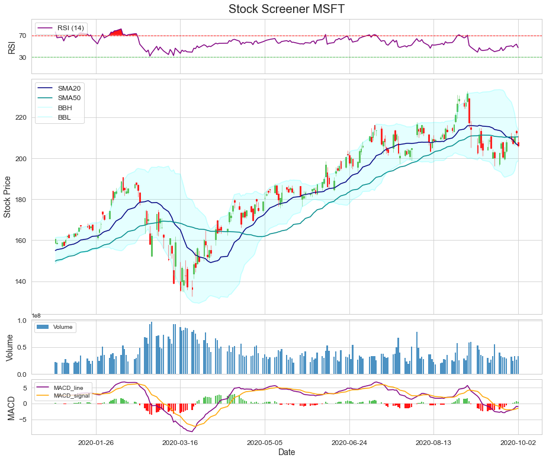

## Python Stock Screener
---

This work has been developed to understand better Technical Analysis Indicators for Stocks.
The code is meant to be reproducible with ease and is still a work in progress!

I can see this tool being used for many different reasons, but for me this is a step one in order to better understand Momentum Indicators for Stocks as well as visualize trading strategies.

Following a Snapshot of Microsoft's Stock Performance for 2020!

### Next Steps
---
- Visually analyze the impact of Earnings Calls and Release of SEC Filings on Specific Stocks.
